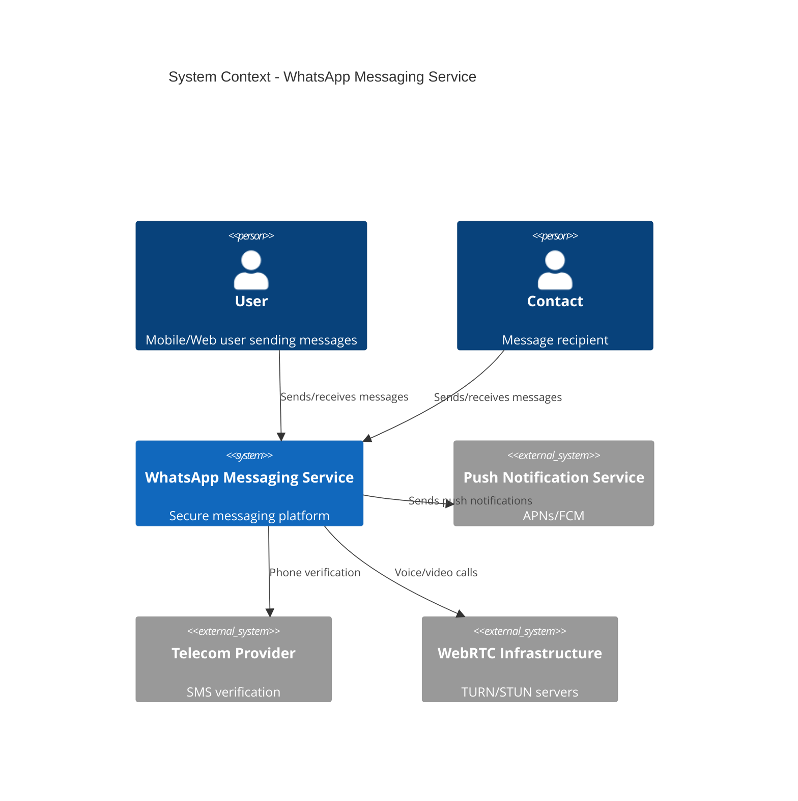
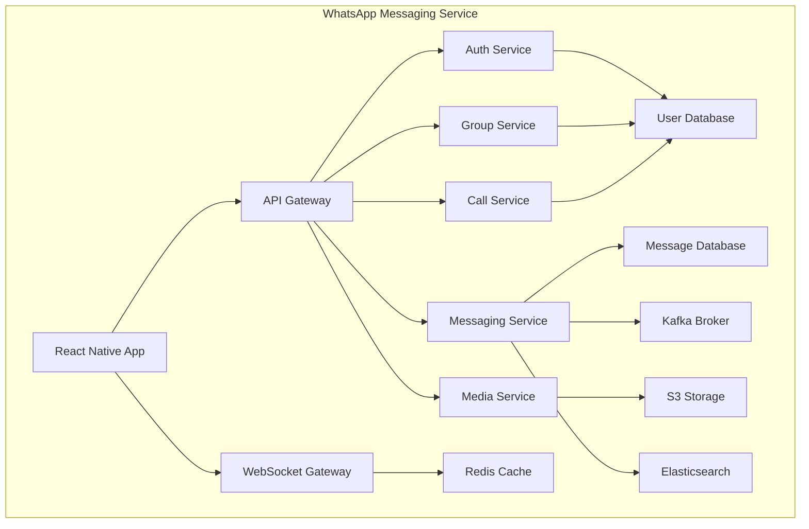
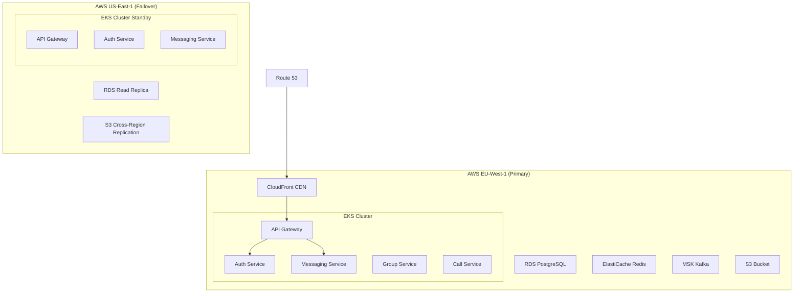
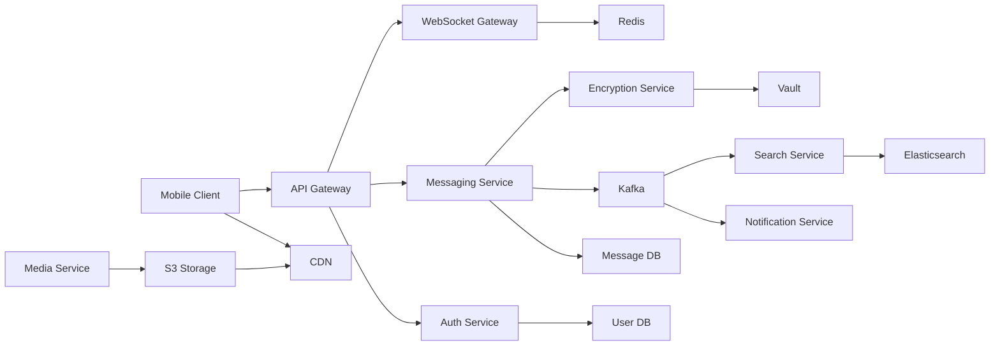

# Architecture - whatsapp-messaging-service

## Overview

| Property | Value |
|----------|-------|
| Architecture Pattern | **Microservices** |
| Communication Patterns | REST, WebSocket, Event-Driven, gRPC |
| Total Services | 26 |

---

## Services

### api-gateway

| Property | Value |
|----------|-------|
| Type | gateway |
| Technology | Kong 3.6.0 |
| Ports | 8080, 8443 |

**Responsibilities:**
- Request routing
- Rate limiting
- Authentication
- API versioning

### auth-service

| Property | Value |
|----------|-------|
| Type | api |
| Technology | NestJS 10.3.2 |
| Ports | 3001 |
| Dependencies | user-db, redis-cache, kafka-broker |

**Responsibilities:**
- Phone number registration
- 2FA management
- Biometric auth
- Multi-device support
- Passkey authentication

### user-service

| Property | Value |
|----------|-------|
| Type | api |
| Technology | NestJS 10.3.2 |
| Ports | 3002 |
| Dependencies | user-db, s3-storage, redis-cache |

**Responsibilities:**
- Profile management
- Display name
- Status text
- Profile picture
- QR code generation

### messaging-service

| Property | Value |
|----------|-------|
| Type | api |
| Technology | NestJS 10.3.2 |
| Ports | 3003 |
| Dependencies | message-db, kafka-broker, redis-cache, s3-storage |

**Responsibilities:**
- Text messaging
- Voice messages
- Message editing
- Message deletion
- Message forwarding
- Quote replies
- Reactions

### group-service

| Property | Value |
|----------|-------|
| Type | api |
| Technology | NestJS 10.3.2 |
| Ports | 3004 |
| Dependencies | group-db, kafka-broker, redis-cache |

**Responsibilities:**
- Group creation
- Group administration
- Invitation links
- Communities
- Channels
- Polls
- Events

### call-service

| Property | Value |
|----------|-------|
| Type | api |
| Technology | NestJS 10.3.2 |
| Ports | 3005 |
| Dependencies | call-db, webrtc-signaling, kafka-broker |

**Responsibilities:**
- Voice calls
- Video calls
- Group calls
- Screen sharing
- Call links
- Call rejection messages

### notification-service

| Property | Value |
|----------|-------|
| Type | worker |
| Technology | NestJS 10.3.2 |
| Ports | 3006 |
| Dependencies | kafka-broker, redis-cache |

**Responsibilities:**
- Push notifications
- Email notifications
- SMS notifications
- Notification preferences

### media-service

| Property | Value |
|----------|-------|
| Type | api |
| Technology | NestJS 10.3.2 |
| Ports | 3007 |
| Dependencies | s3-storage, redis-cache, kafka-broker |

**Responsibilities:**
- Media upload
- Media processing
- Thumbnail generation
- Media encryption
- View-once media

### encryption-service

| Property | Value |
|----------|-------|
| Type | api |
| Technology | NestJS 10.3.2 |
| Ports | 3008 |
| Dependencies | vault, redis-cache |

**Responsibilities:**
- End-to-end encryption
- Key management
- Signal protocol implementation
- Message encryption/decryption

### search-service

| Property | Value |
|----------|-------|
| Type | api |
| Technology | NestJS 10.3.2 |
| Ports | 3009 |
| Dependencies | elasticsearch, kafka-broker |

**Responsibilities:**
- Message search
- Contact search
- Group search
- Search indexing

### websocket-gateway

| Property | Value |
|----------|-------|
| Type | api |
| Technology | NestJS 10.3.2 |
| Ports | 3010 |
| Dependencies | redis-cache, kafka-broker |

**Responsibilities:**
- Real-time messaging
- Presence status
- Typing indicators
- Message delivery status

### user-db

| Property | Value |
|----------|-------|
| Type | database |
| Technology | PostgreSQL 16.2 |
| Ports | 5432 |

**Responsibilities:**
- User data persistence
- Profile storage
- Authentication data

### message-db

| Property | Value |
|----------|-------|
| Type | database |
| Technology | PostgreSQL 16.2 |
| Ports | 5433 |

**Responsibilities:**
- Message persistence
- Chat history
- Message metadata

### group-db

| Property | Value |
|----------|-------|
| Type | database |
| Technology | PostgreSQL 16.2 |
| Ports | 5434 |

**Responsibilities:**
- Group data
- Community data
- Channel data
- Membership data

### call-db

| Property | Value |
|----------|-------|
| Type | database |
| Technology | PostgreSQL 16.2 |
| Ports | 5435 |

**Responsibilities:**
- Call history
- Call metadata
- Call recordings

### redis-cache

| Property | Value |
|----------|-------|
| Type | cache |
| Technology | Redis 7.2.4 |
| Ports | 6379 |

**Responsibilities:**
- Session storage
- Caching
- Rate limiting
- Presence data

### kafka-broker

| Property | Value |
|----------|-------|
| Type | queue |
| Technology | Kafka 3.6.1 |
| Ports | 9092 |

**Responsibilities:**
- Event streaming
- Message queuing
- Event sourcing
- Service communication

### elasticsearch

| Property | Value |
|----------|-------|
| Type | search_engine |
| Technology | Elasticsearch 8.12.2 |
| Ports | 9200 |

**Responsibilities:**
- Search indexing
- Full-text search
- Analytics
- Logging

### s3-storage

| Property | Value |
|----------|-------|
| Type | storage |
| Technology | AWS S3 |
| Ports | 443 |

**Responsibilities:**
- Media storage
- File storage
- Backup storage
- Profile pictures

### cdn

| Property | Value |
|----------|-------|
| Type | cdn |
| Technology | AWS CloudFront |
| Ports | 80, 443 |
| Dependencies | s3-storage |

**Responsibilities:**
- Content delivery
- Media caching
- Global distribution
- DDoS protection

### istio-mesh

| Property | Value |
|----------|-------|
| Type | mesh |
| Technology | Istio 1.20 |
| Ports | 15000, 15001 |

**Responsibilities:**
- Service mesh
- Traffic management
- Security policies
- Observability

### vault

| Property | Value |
|----------|-------|
| Type | storage |
| Technology | HashiCorp Vault |
| Ports | 8200 |

**Responsibilities:**
- Secret management
- Key storage
- Certificate management
- Encryption keys

### prometheus

| Property | Value |
|----------|-------|
| Type | api |
| Technology | Prometheus 2.50 |
| Ports | 9090 |

**Responsibilities:**
- Metrics collection
- Alerting
- Monitoring
- Time series data

### grafana

| Property | Value |
|----------|-------|
| Type | api |
| Technology | Grafana 10.3 |
| Ports | 3000 |
| Dependencies | prometheus |

**Responsibilities:**
- Metrics visualization
- Dashboards
- Alerting UI
- Monitoring UI

### jaeger

| Property | Value |
|----------|-------|
| Type | api |
| Technology | Jaeger 1.54 |
| Ports | 16686, 14268 |
| Dependencies | elasticsearch |

**Responsibilities:**
- Distributed tracing
- Request tracking
- Performance monitoring
- Trace analysis

### webrtc-signaling

| Property | Value |
|----------|-------|
| Type | api |
| Technology | Node.js 20.11.1 |
| Ports | 3011 |
| Dependencies | redis-cache |

**Responsibilities:**
- WebRTC signaling
- Peer connection
- Media negotiation
- TURN/STUN server

---

## C4 Context Diagram

## C4 Container Diagram

## Deployment Diagram

## Data Flow Diagram

---

See `architecture/` directory for individual `.mmd` diagram files.
