# State Machines

Insgesamt **12** State Machines identifiziert.

---

## 1. User Registration

_Durchläuft Registrierung von unregistriert über Telefonnummer-Eingabe, Verifizierung bis hin zu vollständig registriert_

### Zustaende

| Zustand | Typ |
|---------|-----|
| `unregistered` | Initial |
| `phone_number_entered` |  |
| `verification_code_sent` |  |
| `verification_pending` |  |
| `verification_failed` |  |
| `fully_registered` | Final |
| `registration_expired` | Final |

### Uebergaenge

| Von | Nach | Trigger | Guard | Action |
|-----|------|---------|-------|--------|
| `unregistered` | `phone_number_entered` | `enter_phone_number` | phone_number_valid | validate_phone_format |
| `phone_number_entered` | `verification_code_sent` | `request_verification` | phone_number_not_blocked | generate_and_send_verification_code |
| `verification_code_sent` | `verification_pending` | `code_delivered` | - | start_verification_timer |
| `verification_pending` | `fully_registered` | `submit_verification_code` | verification_code_valid | create_user_account |
| `verification_pending` | `verification_failed` | `submit_verification_code` | verification_code_invalid | increment_failed_attempts |
| `verification_pending` | `registration_expired` | `verification_timeout` | - | cleanup_verification_data |
| `verification_failed` | `verification_pending` | `retry_verification` | max_attempts_not_reached | allow_retry |
| `verification_failed` | `registration_expired` | `retry_verification` | max_attempts_reached | block_phone_temporarily |
| `verification_code_sent` | `verification_code_sent` | `resend_code` | resend_limit_not_reached | generate_and_send_new_code |
| `phone_number_entered` | `unregistered` | `cancel_registration` | - | clear_phone_number |
| `verification_pending` | `unregistered` | `cancel_registration` | - | cleanup_verification_data |
| `verification_failed` | `unregistered` | `cancel_registration` | - | cleanup_verification_data |

### Diagramm

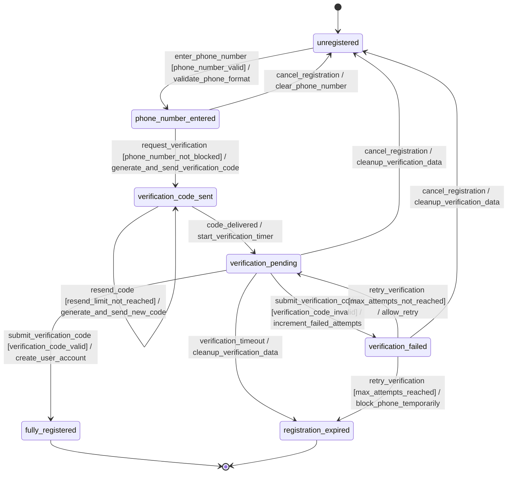

### Quell-Requirements

- WA-AUTH-001

---

## 2. Two Factor Authentication

_Zustandsübergänge von deaktiviert zu aktiviert, sowie Authentifizierungsversuche von ausstehend zu erfolgreich/fehlgeschlagen_

### Zustaende

| Zustand | Typ |
|---------|-----|
| `disabled` | Initial |
| `enabling` |  |
| `enabled` |  |
| `authenticating` |  |
| `authenticated` | Final |
| `authentication_failed` |  |
| `disabled_after_failure` | Final |

### Uebergaenge

| Von | Nach | Trigger | Guard | Action |
|-----|------|---------|-------|--------|
| `disabled` | `enabling` | `enable_2fa` | user_authenticated | generate_setup_qr_code |
| `enabling` | `enabled` | `confirm_setup` | valid_6_digit_pin | store_secret_key |
| `enabling` | `disabled` | `cancel_setup` | - | discard_setup_data |
| `enabled` | `authenticating` | `request_authentication` | user_login_valid | prompt_for_2fa_pin |
| `enabled` | `disabled` | `disable_2fa` | user_authenticated | remove_secret_key |
| `authenticating` | `authenticated` | `submit_pin` | pin_matches_and_valid_6_digits | grant_access |
| `authenticating` | `authentication_failed` | `submit_pin` | pin_invalid_or_expired | increment_failure_count |
| `authentication_failed` | `authenticating` | `retry_authentication` | failure_count_below_limit | prompt_for_2fa_pin |
| `authentication_failed` | `disabled_after_failure` | `max_attempts_reached` | failure_count_exceeded | disable_2fa_and_notify_user |
| `authenticated` | `enabled` | `session_expired` | - | clear_authentication_state |

### Diagramm

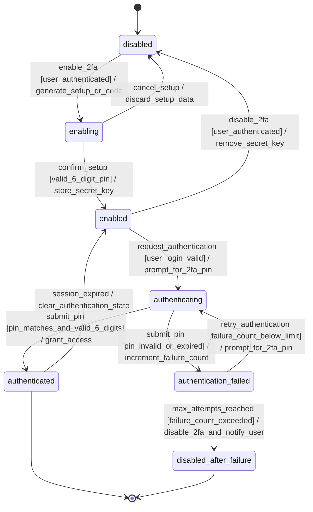

### Quell-Requirements

- WA-AUTH-002

---

## 3. Device Session

_Lebenszyklus von Gerätesitzungen: angemeldet, aktiv, inaktiv, abgemeldet mit Multi-Device-Synchronisation_

### Zustaende

| Zustand | Typ |
|---------|-----|
| `disconnected` | Initial |
| `authenticating` |  |
| `authenticated` |  |
| `active` |  |
| `inactive` |  |
| `synchronizing` |  |
| `suspended` |  |
| `expired` |  |
| `terminated` | Final |

### Uebergaenge

| Von | Nach | Trigger | Guard | Action |
|-----|------|---------|-------|--------|
| `disconnected` | `authenticating` | `login_attempt` | device_registered | start_authentication |
| `authenticating` | `authenticated` | `authentication_success` | credentials_valid | create_session_token |
| `authenticating` | `disconnected` | `authentication_failed` | - | log_failed_attempt |
| `authenticated` | `synchronizing` | `sync_required` | multi_device_enabled | start_device_sync |
| `authenticated` | `active` | `session_established` | - | notify_other_devices |
| `synchronizing` | `active` | `sync_completed` | - | update_device_state |
| `synchronizing` | `suspended` | `sync_failed` | max_retries_exceeded | suspend_session |
| `active` | `inactive` | `inactivity_timeout` | no_user_activity | reduce_session_priority |
| `active` | `synchronizing` | `device_state_changed` | other_device_active | start_state_sync |
| `active` | `terminated` | `logout` | - | cleanup_session |
| `inactive` | `active` | `user_activity` | session_valid | restore_session_priority |
| `inactive` | `expired` | `session_timeout` | max_inactive_time_reached | mark_session_expired |
| `inactive` | `terminated` | `force_logout` | - | cleanup_session |
| `suspended` | `authenticating` | `retry_connection` | retry_allowed | reset_sync_state |
| `suspended` | `terminated` | `session_abandoned` | max_suspend_time_reached | cleanup_session |
| `expired` | `disconnected` | `session_cleanup` | - | remove_expired_session |
| `expired` | `authenticating` | `reauth_attempt` | device_still_registered | start_reauthentication |

### Diagramm

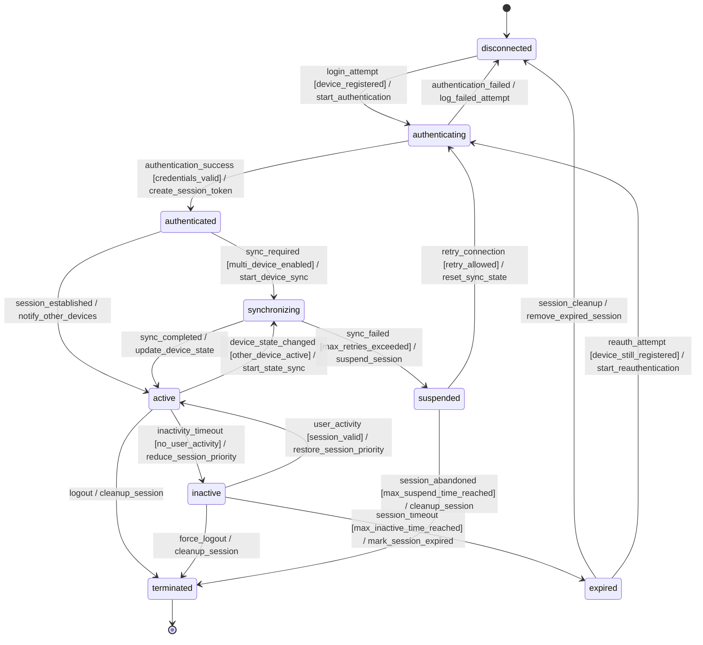

### Quell-Requirements

- WA-AUTH-004

---

## 4. Passkey Authentication

_Zustandsübergänge von nicht eingerichtet zu eingerichtet und Authentifizierungsversuche_

### Zustaende

| Zustand | Typ |
|---------|-----|
| `not_configured` | Initial |
| `registration_initiated` |  |
| `registration_pending` |  |
| `configured` |  |
| `authentication_initiated` |  |
| `authentication_pending` |  |
| `authenticated` | Final |
| `registration_failed` |  |
| `authentication_failed` |  |
| `disabled` | Final |

### Uebergaenge

| Von | Nach | Trigger | Guard | Action |
|-----|------|---------|-------|--------|
| `not_configured` | `registration_initiated` | `initiate_passkey_registration` | user_authenticated_with_password | generate_registration_challenge |
| `registration_initiated` | `registration_pending` | `send_registration_challenge` | - | send_challenge_to_client |
| `registration_pending` | `configured` | `complete_registration` | registration_response_valid | store_passkey_credentials |
| `registration_pending` | `registration_failed` | `registration_timeout` | - | cleanup_registration_session |
| `registration_pending` | `registration_failed` | `invalid_registration_response` | - | log_registration_failure |
| `registration_failed` | `not_configured` | `retry_registration` | retry_attempts_available | increment_retry_counter |
| `configured` | `authentication_initiated` | `initiate_passkey_authentication` | - | generate_authentication_challenge |
| `authentication_initiated` | `authentication_pending` | `send_authentication_challenge` | - | send_challenge_to_client |
| `authentication_pending` | `authenticated` | `complete_authentication` | authentication_response_valid | create_user_session |
| `authentication_pending` | `authentication_failed` | `authentication_timeout` | - | cleanup_authentication_session |
| `authentication_pending` | `authentication_failed` | `invalid_authentication_response` | - | log_authentication_failure |
| `authentication_failed` | `configured` | `retry_authentication` | retry_attempts_available | increment_retry_counter |
| `authentication_failed` | `disabled` | `max_retries_exceeded` | - | disable_passkey_temporarily |
| `authenticated` | `configured` | `session_expired` | - | cleanup_user_session |
| `configured` | `not_configured` | `revoke_passkey` | user_authorized | delete_passkey_credentials |
| `disabled` | `configured` | `re_enable_passkey` | cooldown_period_expired | reset_retry_counter |

### Diagramm

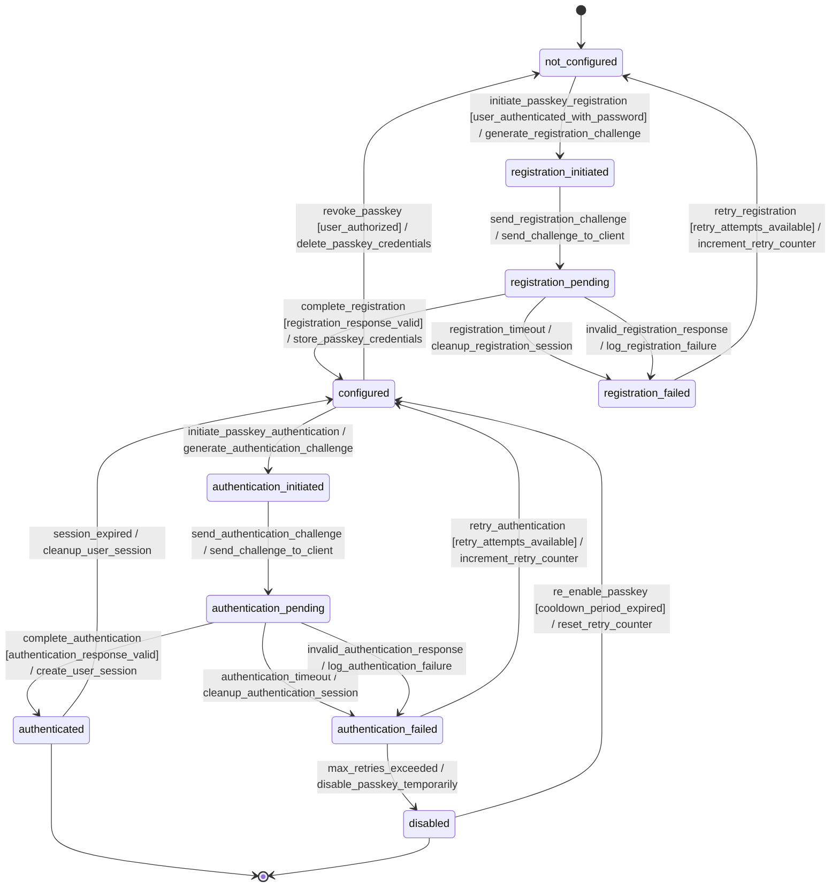

### Quell-Requirements

- WA-AUTH-005

---

## 5. Message

_Komplexer Lebenszyklus: erstellt, gesendet, zugestellt, gelesen, bearbeitet, gelöscht, mit verschwindenden Nachrichten_

### Zustaende

| Zustand | Typ |
|---------|-----|
| `draft` | Initial |
| `sending` |  |
| `sent` |  |
| `delivered` |  |
| `read` |  |
| `edited` |  |
| `deleted_by_sender` | Final |
| `deleted_by_recipient` | Final |
| `expired` | Final |
| `send_failed` |  |

### Uebergaenge

| Von | Nach | Trigger | Guard | Action |
|-----|------|---------|-------|--------|
| `draft` | `sending` | `send_message` | recipient_available | initiate_transmission |
| `sending` | `sent` | `transmission_completed` | - | update_sender_status |
| `sending` | `send_failed` | `transmission_failed` | - | log_error |
| `send_failed` | `sending` | `retry_send` | retry_attempts_available | increment_retry_counter |
| `send_failed` | `deleted_by_sender` | `abandon_send` | - | cleanup_message |
| `sent` | `delivered` | `delivery_confirmed` | - | update_delivery_status |
| `delivered` | `read` | `message_opened` | - | update_read_status |
| `sent` | `edited` | `edit_message` | edit_time_window_valid | update_message_content |
| `delivered` | `edited` | `edit_message` | edit_time_window_valid | update_message_content |
| `read` | `edited` | `edit_message` | edit_time_window_valid | update_message_content |
| `edited` | `delivered` | `edit_completed` | recipient_not_read_edit | notify_edit |
| `edited` | `read` | `edit_completed` | recipient_already_read | notify_edit |
| `sent` | `deleted_by_sender` | `delete_for_everyone` | delete_time_window_valid | remove_message_content |
| `delivered` | `deleted_by_sender` | `delete_for_everyone` | delete_time_window_valid | remove_message_content |
| `read` | `deleted_by_sender` | `delete_for_everyone` | delete_time_window_valid | remove_message_content |
| `edited` | `deleted_by_sender` | `delete_for_everyone` | delete_time_window_valid | remove_message_content |
| `delivered` | `deleted_by_recipient` | `delete_for_me` | - | hide_from_recipient |
| `read` | `deleted_by_recipient` | `delete_for_me` | - | hide_from_recipient |
| `sent` | `expired` | `expiration_timer_elapsed` | is_disappearing_message | auto_delete_message |
| `delivered` | `expired` | `expiration_timer_elapsed` | is_disappearing_message | auto_delete_message |
| `read` | `expired` | `expiration_timer_elapsed` | is_disappearing_message | auto_delete_message |
| `edited` | `expired` | `expiration_timer_elapsed` | is_disappearing_message | auto_delete_message |

### Diagramm

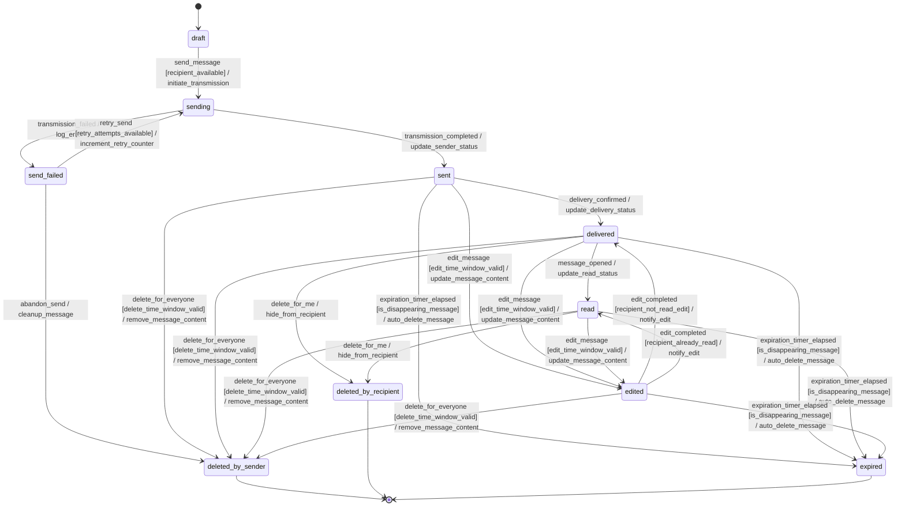

### Quell-Requirements

- WA-MSG-001
- WA-MSG-003
- WA-MSG-004
- WA-MSG-008

---

## 6. Voice Message

_Zustandsübergänge von Aufnahme über Verarbeitung bis hin zu gesendet/zugestellt_

### Zustaende

| Zustand | Typ |
|---------|-----|
| `idle` | Initial |
| `recording` |  |
| `recorded` |  |
| `processing` |  |
| `processed` |  |
| `sending` |  |
| `sent` |  |
| `delivered` | Final |
| `failed` | Final |
| `cancelled` | Final |

### Uebergaenge

| Von | Nach | Trigger | Guard | Action |
|-----|------|---------|-------|--------|
| `idle` | `recording` | `start_recording` | microphone_available | initialize_audio_capture |
| `recording` | `recorded` | `stop_recording` | min_duration_reached | save_audio_data |
| `recording` | `cancelled` | `cancel_recording` | - | discard_audio_data |
| `recording` | `failed` | `recording_error` | - | log_error |
| `recorded` | `processing` | `start_processing` | audio_data_valid | begin_audio_encoding |
| `recorded` | `cancelled` | `discard_message` | - | delete_audio_file |
| `processing` | `processed` | `processing_complete` | encoding_successful | generate_audio_metadata |
| `processing` | `failed` | `processing_error` | - | log_processing_error |
| `processed` | `sending` | `send_message` | network_available | upload_to_server |
| `processed` | `cancelled` | `cancel_send` | - | delete_processed_file |
| `sending` | `sent` | `upload_complete` | server_acknowledged | update_message_status |
| `sending` | `failed` | `upload_failed` | - | retry_or_mark_failed |
| `sent` | `delivered` | `delivery_confirmed` | - | notify_sender |
| `sent` | `failed` | `delivery_failed` | max_retries_exceeded | mark_as_undeliverable |
| `failed` | `processing` | `retry_processing` | retry_count_valid | reset_processing_state |
| `failed` | `sending` | `retry_sending` | retry_count_valid | reset_upload_state |

### Diagramm

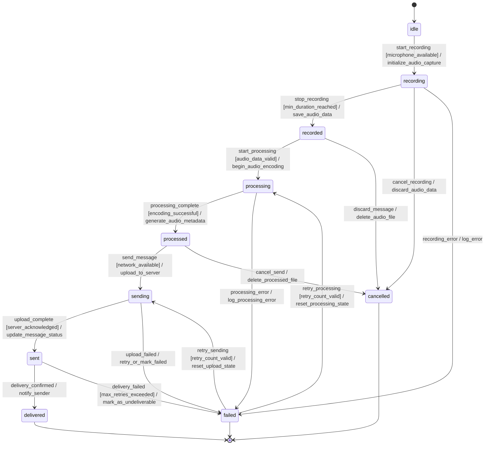

### Quell-Requirements

- WA-MSG-002

---

## 7. View Once Media

_Spezifischer Lebenszyklus: erstellt, gesendet, angezeigt, automatisch gelöscht nach einmaliger Ansicht_

### Zustaende

| Zustand | Typ |
|---------|-----|
| `created` | Initial |
| `uploaded` |  |
| `sent` |  |
| `delivered` |  |
| `viewed` |  |
| `deleted` | Final |
| `expired` | Final |
| `failed` |  |

### Uebergaenge

| Von | Nach | Trigger | Guard | Action |
|-----|------|---------|-------|--------|
| `created` | `uploaded` | `upload_completed` | media_valid | store_media_metadata |
| `created` | `failed` | `upload_failed` | - | log_upload_error |
| `uploaded` | `sent` | `message_sent` | recipient_available | mark_as_view_once |
| `uploaded` | `failed` | `send_failed` | - | cleanup_uploaded_media |
| `sent` | `delivered` | `delivery_confirmed` | - | start_expiry_timer |
| `sent` | `expired` | `delivery_timeout` | max_delivery_time_exceeded | auto_delete_media |
| `delivered` | `viewed` | `media_opened` | recipient_authenticated | track_view_event |
| `delivered` | `expired` | `expiry_timeout` | max_view_time_exceeded | auto_delete_media |
| `viewed` | `deleted` | `view_completed` | - | permanent_delete_media |
| `viewed` | `deleted` | `view_interrupted` | partial_view_detected | permanent_delete_media |

### Diagramm

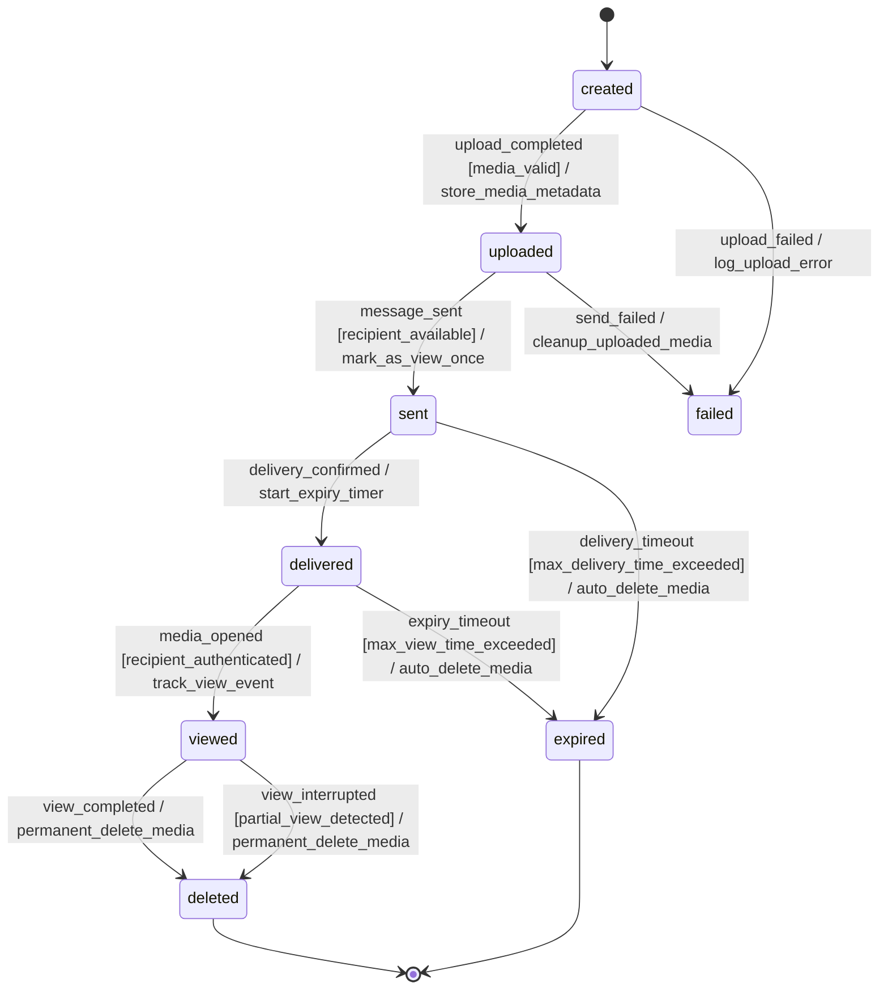

### Quell-Requirements

- WA-MSG-009

---

## 8. Chat Lock

_Zustandsübergänge zwischen entsperrt und gesperrt mit zusätzlicher Authentifizierung_

### Zustaende

| Zustand | Typ |
|---------|-----|
| `unlocked` | Initial |
| `lock_pending` |  |
| `locked` | Final |
| `unlock_pending` |  |
| `authentication_failed` |  |
| `lock_error` |  |

### Uebergaenge

| Von | Nach | Trigger | Guard | Action |
|-----|------|---------|-------|--------|
| `unlocked` | `lock_pending` | `lock_requested` | user_authorized | initiate_authentication |
| `lock_pending` | `locked` | `authentication_successful` | credentials_valid | apply_lock |
| `lock_pending` | `authentication_failed` | `authentication_failed` | - | log_failed_attempt |
| `lock_pending` | `lock_error` | `system_error` | - | log_error |
| `authentication_failed` | `unlocked` | `retry_timeout` | - | reset_authentication |
| `authentication_failed` | `lock_pending` | `retry_authentication` | retry_allowed | initiate_authentication |
| `lock_error` | `unlocked` | `error_resolved` | - | clear_error_state |
| `locked` | `unlock_pending` | `unlock_requested` | user_authorized | initiate_authentication |
| `unlock_pending` | `unlocked` | `authentication_successful` | credentials_valid | remove_lock |
| `unlock_pending` | `authentication_failed` | `authentication_failed` | - | log_failed_attempt |
| `unlock_pending` | `lock_error` | `system_error` | - | log_error |

### Diagramm

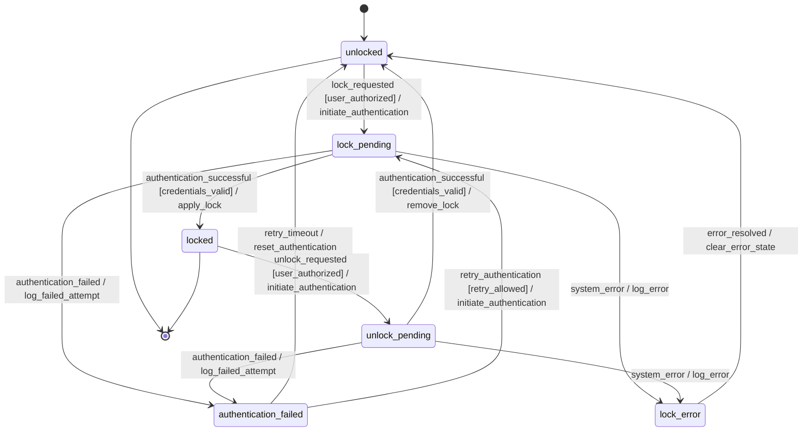

### Quell-Requirements

- WA-MSG-010

---

## 9. Broadcast Message

_Lebenszyklus von Erstellung über Verteilung an mehrere Empfänger bis zur Zustellung_

### Zustaende

| Zustand | Typ |
|---------|-----|
| `draft` | Initial |
| `validating` |  |
| `scheduled` |  |
| `distributing` |  |
| `partially_delivered` |  |
| `delivered` | Final |
| `failed` | Final |
| `cancelled` | Final |
| `expired` | Final |

### Uebergaenge

| Von | Nach | Trigger | Guard | Action |
|-----|------|---------|-------|--------|
| `draft` | `validating` | `submit` | has_recipients_and_content | validate_broadcast_list |
| `draft` | `cancelled` | `cancel` | - | cleanup_draft |
| `validating` | `scheduled` | `validation_success` | all_recipients_valid | schedule_distribution |
| `validating` | `failed` | `validation_failed` | critical_validation_errors | log_validation_errors |
| `scheduled` | `distributing` | `distribution_time_reached` | system_ready | start_distribution |
| `scheduled` | `cancelled` | `cancel` | - | cancel_scheduled_distribution |
| `scheduled` | `expired` | `schedule_expired` | past_max_delivery_time | mark_as_expired |
| `distributing` | `partially_delivered` | `partial_delivery_complete` | some_deliveries_failed | update_delivery_status |
| `distributing` | `delivered` | `all_delivered` | all_recipients_reached | mark_complete |
| `distributing` | `failed` | `distribution_failed` | critical_system_error | log_distribution_error |
| `partially_delivered` | `distributing` | `retry_failed_deliveries` | retry_attempts_available | restart_failed_deliveries |
| `partially_delivered` | `delivered` | `remaining_delivered` | all_retries_successful | mark_complete |
| `partially_delivered` | `failed` | `max_retries_exceeded` | no_more_retry_attempts | mark_partially_failed |

### Diagramm

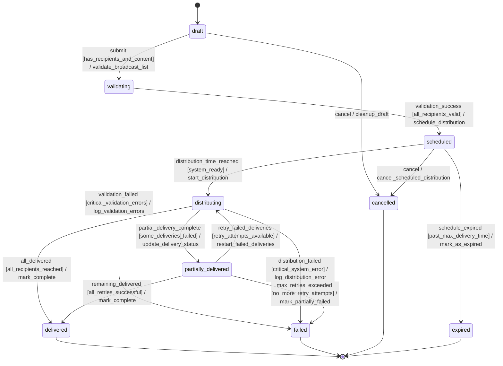

### Quell-Requirements

- WA-MSG-011

---

## 10. Group

_Lebenszyklus von Erstellung über aktive Verwaltung bis hin zu verlassen/aufgelöst_

### Zustaende

| Zustand | Typ |
|---------|-----|
| `draft` | Initial |
| `active` |  |
| `suspended` |  |
| `left` | Final |
| `dissolved` | Final |
| `error` |  |

### Uebergaenge

| Von | Nach | Trigger | Guard | Action |
|-----|------|---------|-------|--------|
| `draft` | `active` | `create_group` | valid_group_data | initialize_group_settings |
| `draft` | `error` | `create_group` | invalid_group_data | log_creation_error |
| `active` | `active` | `add_member` | is_admin_or_creator | send_member_added_notification |
| `active` | `active` | `remove_member` | is_admin_or_creator | send_member_removed_notification |
| `active` | `active` | `update_group_settings` | is_admin_or_creator | apply_settings_changes |
| `active` | `active` | `promote_to_admin` | is_creator | grant_admin_privileges |
| `active` | `active` | `demote_admin` | is_creator | revoke_admin_privileges |
| `active` | `suspended` | `suspend_group` | is_admin_or_creator | disable_messaging |
| `active` | `left` | `leave_group` | is_member_not_creator | remove_member_silently |
| `active` | `dissolved` | `dissolve_group` | is_creator_or_all_members_left | notify_dissolution |
| `suspended` | `active` | `reactivate_group` | is_admin_or_creator | enable_messaging |
| `suspended` | `left` | `leave_group` | is_member_not_creator | remove_member_silently |
| `suspended` | `dissolved` | `dissolve_group` | is_creator_or_all_members_left | notify_dissolution |
| `error` | `draft` | `retry_creation` | - | reset_group_data |

### Diagramm

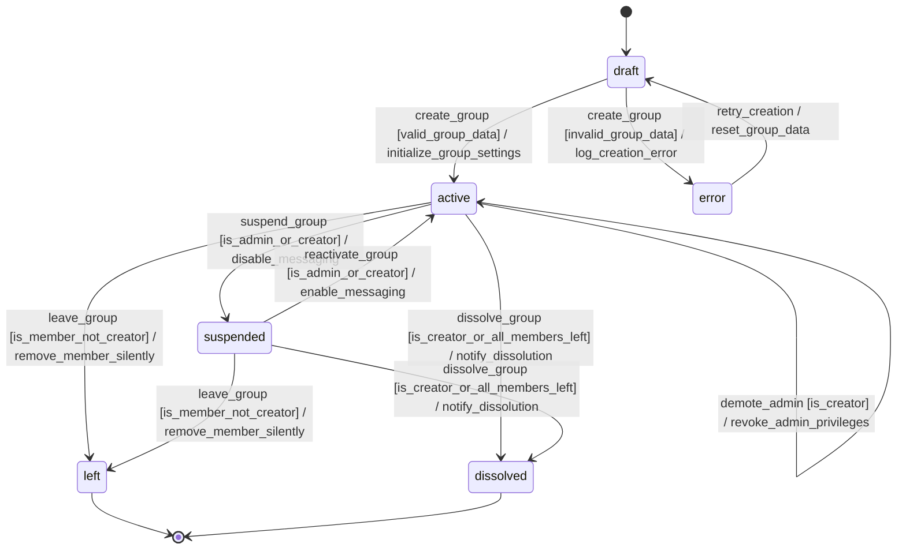

### Quell-Requirements

- WA-GRP-001
- WA-GRP-002
- WA-GRP-005

---

## 11. Group Invitation

_Zustandsübergänge von erstellt über versendet zu angenommen/abgelehnt/abgelaufen_

### Zustaende

| Zustand | Typ |
|---------|-----|
| `created` | Initial |
| `sent` |  |
| `accepted` | Final |
| `declined` | Final |
| `expired` | Final |
| `cancelled` | Final |
| `failed` |  |

### Uebergaenge

| Von | Nach | Trigger | Guard | Action |
|-----|------|---------|-------|--------|
| `created` | `sent` | `send_invitation` | recipient_valid | generate_invitation_link |
| `created` | `failed` | `send_invitation` | recipient_invalid | log_error |
| `created` | `cancelled` | `cancel_invitation` | - | notify_creator |
| `sent` | `accepted` | `accept_invitation` | invitation_not_expired | add_user_to_group |
| `sent` | `declined` | `decline_invitation` | invitation_not_expired | notify_group_admin |
| `sent` | `expired` | `expire_invitation` | - | cleanup_invitation_link |
| `sent` | `cancelled` | `cancel_invitation` | - | invalidate_invitation_link |
| `sent` | `expired` | `accept_invitation` | invitation_expired | notify_invitation_expired |
| `sent` | `expired` | `decline_invitation` | invitation_expired | notify_invitation_expired |
| `failed` | `sent` | `retry_send` | retry_limit_not_exceeded | generate_invitation_link |
| `failed` | `cancelled` | `cancel_invitation` | - | notify_creator |

### Diagramm

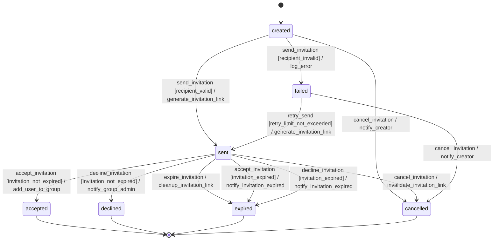

### Quell-Requirements

- WA-GRP-004

---

## 12. Message Reaction

_Lebenszyklus von hinzugefügt über geändert bis entfernt_

### Zustaende

| Zustand | Typ |
|---------|-----|
| `pending` | Initial |
| `active` |  |
| `updated` |  |
| `removed` | Final |
| `failed` | Final |

### Uebergaenge

| Von | Nach | Trigger | Guard | Action |
|-----|------|---------|-------|--------|
| `pending` | `active` | `reaction_added` | valid_emoji_and_message_exists | store_reaction_and_notify_participants |
| `pending` | `failed` | `reaction_rejected` | invalid_emoji_or_message_not_found | log_error_and_notify_user |
| `active` | `updated` | `reaction_changed` | valid_new_emoji | update_reaction_and_notify_participants |
| `active` | `removed` | `reaction_removed` | - | delete_reaction_and_notify_participants |
| `active` | `failed` | `reaction_update_failed` | system_error_or_permission_denied | log_error_and_rollback |
| `updated` | `updated` | `reaction_changed` | valid_new_emoji | update_reaction_and_notify_participants |
| `updated` | `removed` | `reaction_removed` | - | delete_reaction_and_notify_participants |
| `updated` | `failed` | `reaction_update_failed` | system_error_or_permission_denied | log_error_and_rollback |

### Diagramm

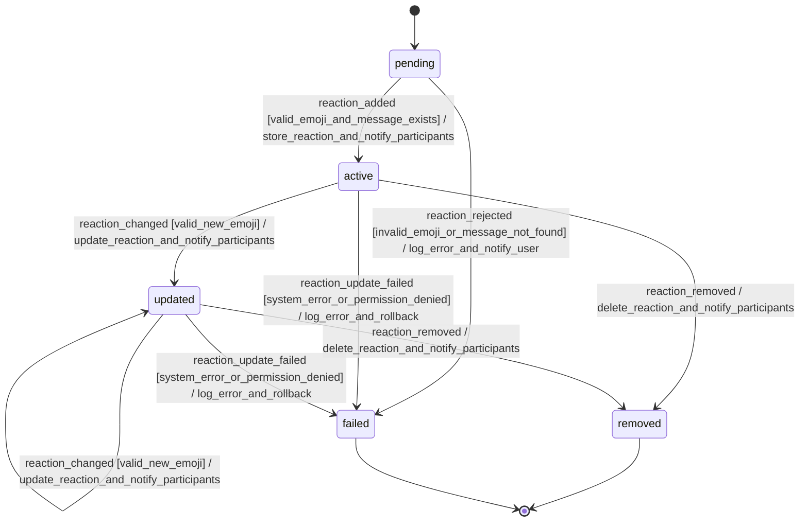

### Quell-Requirements

- WA-MSG-007

---

